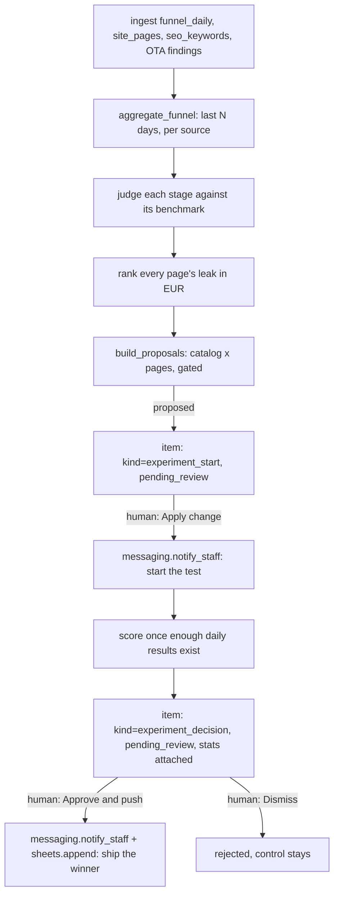

# Funnel Hacking AI — "The Optimizer"

Puts a euro number on every step of your direct-booking funnel - reach,
website sessions, booking-engine clicks, dated searches, bookings - and
tells you which one is actually worth fixing first. Then it helps you fix
it: you curate a small catalog of single-variable test ideas (a button
label, a subline, a photo swap, a sticky booking bar), the agent proposes
which ones are worth running against real benchmarks, and once your A/B
testing tool's daily results come in, it scores them with a real
two-proportion z-test and tells a person to ship only the ones that
actually win. It never touches your live website itself, and it never
touches a price.

## What it does

Tracks conversion at each stage of the direct-booking funnel (visit,
search, inquiry, booking) and prices every leak in euros, so you know which
step is worth fixing first. Then it fixes it: rewrites headlines, images,
and calls-to-action, A/B tests the change live, and rolls out only
statistically significant winners.

## What it won't do

Won't touch pricing or brand voice; tests within the guardrails you set and
flags big swings for review.

## Why it matters

Small conversion gains compound across every visitor, and most hotel
websites are never systematically optimised.

## What to expect

Conversion-optimisation programs typically lift booking conversion 10–30%
over time.

The roster text above is quoted exactly as it appears on the demo
platform's agent menu — this repo does not promise more than that, and
does not promise less. ROI figure: `+20%` direct-booking conversion.

Two honest notes on the "rewrites... A/B tests the change live" language,
kept plain rather than buried: this repo describes a change for a person to
implement in your own CMS or A/B testing tool, it never patches your
website itself — there is no ad platform, analytics API or booking-engine
integration anywhere in this agent family, by design (see
`docs/integrations.md`). And the engine never writes the copy — every
variant comes from a catalog you write in `config/agent.yaml`, not from the
model (see `docs/how-it-works.md` "Design decisions" #2).

## Who it's for

Independent hotels and small groups whose website has never been
systematically tested — where "let's change the button" happens on a
hunch, gets shipped straight to the live site, and nobody ever finds out
whether it actually worked. This agent replaces that guesswork with a
ranked list of what to try first and a real statistical read on whether a
change won, not a person's strategy for the property.

You will get the most from this repo if:

- You have (or can export) a web-analytics report and a booking-engine
  funnel report — sessions, booking-engine clicks, dated searches,
  bookings, by day and by source.
- You already have, or can build, an A/B testing tool on your website
  (your CMS's own split-testing feature, Optimizely, VWO, Google Optimize,
  or a hand-rolled 50/50 split) — this agent tells a person what to test
  and reads the results; it does not run the split itself.
- You are comfortable having someone on your team actually implement a
  tested change — this agent never edits your website.
- You want test ideas ranked by a real euro estimate and scored with real
  statistics, not "it felt like it worked."

It is less of a fit if your website gets very little traffic (a
two-proportion z-test needs real sample size to say anything, and a
19-session-a-day site will wait a long time for a decision), or if you have
no way at all to export analytics or booking-engine data — this agent needs
somewhere to read your funnel from.

## How it works

One deterministic funnel-analysis engine plus a second deterministic pass
that scores experiments once real results arrive — no randomness, no model
call anywhere near a number.



`tools/funnel_engine.py` is the whole decision engine and has no I/O in it:
plain dataclasses in, a ranked bottleneck, a list of proposals and a
step-by-step thinking log out. `tools/run.py` is the only place that talks
to the store and the LLM. The **only** model call in this agent's main
loop writes a short growth note about a run that already finished
(`prompts/funnel_note.md`) — it cannot move a decision. Full detail and the
12 design decisions taken where the source this repo was built from left a
gap: `docs/how-it-works.md`.

### The two modes

| Mode | What happens |
|---|---|
| `shadow` (default) | Reads, analyzes, drafts every proposal and decision, and queues. **Never** notifies staff or writes to a sheet — including an item you already approved; the approval is recorded, sending waits for `mode: live`. |
| `live` | Items that are approved actually send. Everything else still waits. |

### The review loop

Nothing starts a test, and nothing ships a winner, without a person, or a
guardrail, saying so. `workflows/80-review.md` covers the full loop: list,
show, approve, edit, reject, send.

### What runs when

| Workflow | Cadence | Provider used |
|---|---|---|
| `workflows/10-funnel-analysis.md` (`tools/run.py`) | daily, or `make watch` | whatever `llm.provider` is set to (narration only) |
| `workflows/15-experiments.md`, same pass | scores whatever has enough data | none |
| `workflows/80-review.md` (`tools/review.py`) | whenever a human is available | none — queue operations only |

`python3 tools/schedule.py --all` prints one ready-to-paste cron/launchd/
systemd snippet, read straight from `config/agent.yaml: schedule:` — see
"Run it" below.

## What you need

| Item | Required? | Notes |
|---|---|---|
| A computer or small server that can run Python 3.11+ | Yes | Your laptop is fine to start; `workflows/90-go-live.md` covers scheduling it properly. |
| A Claude Code subscription, or your own Anthropic API key | Yes | The `interactive` provider uses the Claude Code session you already have open — zero extra cost, and the model only ever writes a growth note. |
| A web analytics + booking-engine funnel export | Yes | Starts on bundled fixtures; `data/imports/funnel_daily.csv` works with any export. |
| A page catalog (sessions and booking-engine clicks per page) | Yes | `data/imports/site_pages.csv` — even a short, hand-kept list is enough to start. |
| An A/B testing tool on your website | Recommended | This agent tells you what to test; something has to actually run the split. `data/imports/funnel_experiment_daily.csv` reads its daily results. |
| A messaging channel for staff (WhatsApp, or any webhook) | Recommended | How "start this test" / "push this winner" reach a person. Defaults to a local file. |
| A Google Sheet, or nothing at all | Optional | Pushed winners log to local CSV by default; a Sheet is a nicer shared record. |

Time estimate: 15 minutes to see the demo, half a day to connect a real
funnel export and write your first catalog, a few weeks of watching a real
test run before you would reasonably consider going live.

## Quick start (5 minutes, no credentials)

```bash
git clone https://github.com/th1-ai/funnel-hacking-ai.git funnel-hacking-ai
cd funnel-hacking-ai
make setup
make demo
```

You should see something like this:

```
Funnel Hacking AI demo - Hotel Aurora, fixtures/inbound

Growth note: The homepage is the biggest leak: it turns only 3.0% of sessions into a booking-engine click against a 4.0-6.0% benchmark, worth about EUR 400 a month at the benchmark floor. Two more changes are queued from the catalog, on the offers page and the coastal-walks journal post, each worth about EUR 100 a month. Nothing was suppressed this run. The homepage button copy test already running is scored and waiting for a person to look at, since its lift is large enough that the big-swing rule holds it for review rather than shipping it on its own.

  - Read the funnel: last 30 days: 74,876 reached -> 3,399 sessions -> 119 booking-engine clicks (3.5%) -> 88 dated searches -> 26 direct bookings worth EUR 6,760.
  - Judge each stage against benchmark: session -> engine click 3.5% is well under the benchmark (4.0-6.0%). Click -> dated search 73.95% is healthy. Search -> booking 29.55% is healthy (25.0-35.0%).
  - Rank the leak: home converts 3.0% of sessions into a booking-engine click against a 4.0% benchmark floor - worth about EUR 400/mo at the floor.
  - Check running experiments: 1 in flight (cap 2).
  - 3 change(s) proposed. Each one is a single variable, described for a person to implement, split 50/50.
  - Decision: Biggest leak: home converts only 3.0% of sessions into a booking-engine click (benchmark 4.0-6.0%). 3 fix(es) proposed, worth about EUR 400/mo at the benchmark floor.

4 item(s) waiting for a person - starting a test and pushing a winner always do, see docs/safety.md.
Nothing was sent: mode is shadow, and demo never calls notify_staff() or sheets.append() on anything but the bundled fixtures.
Next: `make review` to see what is waiting, or read workflows/10-funnel-analysis.md.

DEMO OK — 4 items processed, 4 drafted, 0 sent (shadow)
```

Every number above comes from an invented hotel, "Hotel Aurora," with 30
days of fabricated funnel data and one experiment pre-seeded as already
running for two weeks — designed so you can see the whole loop (propose,
start, score, decide) finish in a single pass instead of waiting two weeks
for real daily results; see `docs/how-it-works.md` "Design decisions" #10.
A real first run always starts with zero running experiments — see "Next"
below.

Then `make doctor` — expect one `FAIL` (`hotel identity`, because the
property is still the shipped placeholder "Hotel Aurora") and a couple of
`warn` lines. That is the intended state of a fresh clone; see
`workflows/00-setup.md` for filling in the real property. Next: open
`claude` in this folder and follow "Set up with Claude Code" below.

## Set up with Claude Code

Open `claude` in this folder. Paste each prompt below in order — Claude
will follow the named workflow file, which tells it exactly which tools to
run and what to check.

**Phase 1 — first run.**

> Read `workflows/00-setup.md` and walk me through it. I have not run this
> agent before.

**Phase 2 — the funnel analysis.**

> Read `workflows/10-funnel-analysis.md`. Run one pass and show me what
> Funnel Hacking AI found in plain language.

**Phase 3 — the review queue.**

> Read `workflows/80-review.md`. Show me what is waiting for me, one at a
> time, and act on my decisions.

**Phase 4 — running experiments.**

> Read `workflows/15-experiments.md`. Once I have started a test, help me
> log its daily results and act on the decision once it is scored.

**Phase 5 — going live.**

> Read `workflows/90-go-live.md`. Go through the checklist with me
> honestly — do not recommend going live until it is genuinely true.

You can also just run the agent directly — `/funnel-hacking-ai` in this
folder runs the main loop and works the queue in one command; see
`.claude/skills/funnel-hacking-ai/SKILL.md`.

## Connect your systems

Full detail, including the "implement your own" recipe, is in
`docs/integrations.md`. This agent uses only two of the four shared
adapters — **Messaging** and **Sheets** — plus six CSV-based signal inputs
no adapter family in this agent family covers at all.

### Messaging - `systems.messaging.adapter` in `config/hotel.yaml`

| Adapter | Status | Needs |
|---|---|---|
| `mock` | universal | nothing — writes `data/exports/sent_messages.jsonl` |
| `unipile` | built | `UNIPILE_DSN`, `UNIPILE_API_KEY`, `UNIPILE_ACCOUNT_ID`, `UNIPILE_STAFF_CHAT_ID` |
| `webhook` | universal | `MESSAGING_WEBHOOK_URL` — POST to Zapier, Make, n8n, or your own endpoint |

Delivers "start this test" and "push this winner" via `messaging.notify_staff()`.

### Sheets - `systems.sheets.adapter`

| Adapter | Status | Needs |
|---|---|---|
| `csv` | universal | nothing — writes `data/exports/experiment_decisions.csv` |
| `google` | built | `GOOGLE_SHEET_ID`, `GOOGLE_SERVICE_ACCOUNT_FILE` |

Logs every pushed winner: page, element, click-through lift, confidence,
measured euro impact.

### Signals this agent needs, with no adapter

Web analytics, a booking engine's funnel numbers, an SEO rank tracker and
an A/B testing tool's daily results are not something any PMS, email,
messaging or sheets API exposes. `tools/ingest.py` reads them from
`data/imports/*.csv` — falling back to `fixtures/inbound/*.csv` for the
demo.

| File | Columns | Feeds |
|---|---|---|
| `data/imports/funnel_daily.csv` | `date, source, reach, sessions, engine_clicks, engine_searches, bookings, revenue` | the whole daily analysis |
| `data/imports/site_pages.csv` | `slug, title, path, kind (page\|blog), sessions_30d, engine_clicks_30d, sort` | which page is the biggest leak |
| `data/imports/funnel_experiment_daily.csv` | `page_slug, element, day_offset, variant (a\|b), sessions, clicks, bookings` | scoring a running experiment |
| `data/imports/seo_keywords.csv` | `keyword, position, prev_position, volume, clicks_mo, url, note` | the SEO digest only — never a proposal |
| `data/imports/ota_content_findings.csv` | `channel, kind, detail, severity` | cross-agent, read-only — a content-health note |
| `data/imports/ota_listings.csv` | `channel, health_pct, note` | cross-agent, read-only — a channel-health note |

`make doctor`'s "signal sources" line shows which file each one is actually
reading from, or whether it is defaulting to empty.

### Everything else

PMS and email adapters exist in `core/adapters/` (every repo in this family
ships all four) but **this agent uses neither** — it has no PMS write and
no guest inbox, so `make doctor` shows `ok` rows for them without them
mattering here. `pos`, `accounting`, `reviews`, `calendar`, `payments` and
`procurement` are unused stubs, same as every repo in this family.

Check what is actually working on your machine at any time:

```bash
make doctor
```

## Run it

```bash
make run                             # analyze + propose + score
make run ARGS="--dry-run"            # compute everything, queue nothing
make run ARGS="--as-of 2026-09-15"   # rehearse against a specific date
make watch                           # keep the loop running on schedule
```

**Scheduling.** The recurring job lives in `config/agent.yaml: schedule:`
with its own `command:` and `cadence:` — `funnel_analysis` (daily by
default, though it also scores every running experiment on the same pass):

```bash
python3 tools/schedule.py --all
```

prints a ready-to-paste cron/launchd/systemd snippet, read straight from
that block. `scheduler/crontab.example`, `scheduler/launchd.example.plist`,
`scheduler/systemd.example.service` and `scheduler/systemd.example.timer`
have the generic single-job form if you would rather hand-edit.

**Subscription or API.** `llm.provider: interactive` or `claude-code` runs
on the Claude Code subscription you already pay for — genuinely the
cheapest way to run a small hotel's agent, with the caveat that Anthropic's
usage policy governs automated use of a personal subscription (a daily
scheduled run is normal; a much busier schedule is not).
`llm.provider: anthropic` uses your own API key, bills per token, and is
the right choice if you add more frequent scheduled passes. Either way the
model only ever writes a growth note — `make report` shows what you are
actually spending, and it should stay small. See `docs/safety.md` for the
full honest note.

## Go live

Shadow mode is the default and stays the default until you change it. The
full checklist — a real catalog written, real funnel data connected, a few
weeks of real review behind you, the shadow backlog cleared — is in
`workflows/90-go-live.md`. In short:

```yaml
# config/hotel.yaml
mode: live
```

Going live means an **approved** item now actually sends — it does not
change what needs approval. `review.require_approval_for` still lists
`send_message` and `sheets_write` by default, which means every item still
waits for you even in `mode: live`, until you deliberately shorten that
list. `rules.auto_rollout` in `config/agent.yaml` staying `false` is a
second, independent brake — see `workflows/90-go-live.md`. Before flipping
the switch, clear the backlog that built up in shadow mode:

```bash
python3 tools/review.py stale
```

Going back to shadow (`mode: shadow`, or `AGENT_MODE=shadow` in `.env` for
one run) stops every send immediately, mid-schedule, with no other change
required.

## Guardrails & safety

Full detail in `docs/safety.md`. The short version:

**What it will not do.**

- Send anything while `mode: shadow` — including an item you already
  approved. The approval is recorded; sending waits for `mode: live`.
- Touch a price, anywhere. No field in a catalog entry, a proposal, or a
  decision can carry a rate.
- Invent copy. Every variant comes from `config/agent.yaml:
  experiment_catalog:`, written by a person — the model only narrates a
  finished analysis.
- Start a third test while two are already running and
  `rules.max_2_concurrent` is on — `tools/review.py approve` refuses
  outright.
- Push a variant that is not both statistically significant **and**
  actually beating control — a significantly worse variant can never clear
  the gate, in any configuration.

**What always waits for a person**, whatever `rules.auto_rollout` says
(`config/agent.yaml`, enforced in `tools/funnel_engine.py`'s
`classify_decision`):

- A click-through lift past `big_swing_pct` (default 25%) — this is the
  concrete answer to "flags big swings for review."
- Anything that fails the 95% significance bar, when `rules.significance_95`
  is on.
- Starting any test at all — there is no auto path for "Apply change,"
  ever, whatever the rules say.

**Drafted copy becomes guest-facing once you ship it, even though this
agent never sends anything.** `messaging.notify_staff()` talks to your own
team, not to a guest — the EU AI Act Article 50 guest-disclosure pattern
the rest of this family uses does not apply to anything this agent sends.
But a proposal's copy is written to go on your public website once a
person implements it — `rules.brand_voice_lock`'s note exists for exactly
that reason. See `docs/safety.md`.

**Data handling.** Everything lives in `data/agent.db` on your own machine
— there is no cloud service behind this repo. `funnel_daily` and the
review queue hold aggregate counts (sessions, clicks, bookings) per date
and source, not guest identity.

## Customising

**`config/agent.yaml`.** Your real `experiment_catalog` (the one step that
actually makes this agent useful), `benchmarks`, `economics` assumptions,
every guardrail (`significance_bar_pct`, `min_days_running`,
`max_concurrent_experiments`, `big_swing_pct`), the `rules` block,
`schedule:`.

**`knowledge/brand-voice.md`.** Not read by any prompt — a short reference
a person checks a copy proposal against. See `knowledge/README.md`.

**`prompts/funnel_note.md`.** Plain markdown with `{{var}}` placeholders —
edit it to change the growth note's tone. It cannot change a decision; only
the words about one that already happened.

**Adding a language.** There is nothing to add — this agent produces no
guest-facing text at all, and its one internal note is always written in
the language you write the prompt in.

**The restaurant lens.** `docs/how-it-works.md` "Restaurant lens" covers
what changes for a restaurant: the funnel stages, the catalog, and — most
importantly — the benchmark bands, which are hotel numbers with no
evidence behind them for a restaurant funnel.

## Troubleshooting & FAQ

Full list in `workflows/99-troubleshooting.md`. The most common ones:

**`make doctor` shows a FAIL.** Every line has a fix hint right under it —
read it before doing anything else. The "hotel identity" FAIL on a fresh
clone is expected.

**`make run` exits with code 3.** Not an error — `llm.provider: interactive`
is waiting for you to answer the parked growth-note prompt in
`data/pending/`. (`python3 tools/run.py --once` itself really does exit
3 — `make run` prints `make: *** [run] Error 3` in the console, naming the
real code, but Make's own exit status is always 2 for any failed recipe,
GNU Make's own convention, regardless of what the command underneath
exited with. Script against `python3 tools/run.py --once` directly if you
need the real number, not `make run`.) Every proposal it already computed
was queued before this happened.

**A page in my catalog never gets proposed.** Either it is already at or
above its own benchmark, or its `(page_slug, element)` pair already has a
running or undecided test — see `docs/how-it-works.md` "Step 5."

**No decision ever appears for a running test.**
`data/imports/funnel_experiment_daily.csv` needs at least
`min_days_running` (14 by default) distinct `day_offset` values for that
exact pair.

**Can I run this without an A/B testing tool?** You can still get the
ranked, priced list of proposals — Track A works on funnel and page data
alone. Track B (scoring a decision) needs `data/imports/funnel_experiment_daily.csv`
from somewhere; without it, tests stay "running" forever with no decision.

## Measuring the benefit

`make report` shows volumes, tests started, winners pushed, dismissals,
and LLM spend — all computed from `data/agent.db`, nothing phoned home.
See `docs/benefits.md` for what each number means, why they describe what
was *approved* rather than what happened while `mode: shadow`, and the
honest caveats before you quote any of this to someone else.

```bash
make report
python3 tools/report.py --json
```

## About

Built by [TH1](https://th1.ai) — we build and run AI agents for
independent hotels. This repo is free to use, modify and self-host under
the MIT licence (see `LICENSE`).

Want it run for you, tuned to your property, with someone accountable for
the result? [Talk to TH1](https://th1.ai).

**Changelog**

- v1.0 — initial release: the daily funnel analysis and the experiment
  scoring loop, both against a human-curated catalog. No sub-agents; no
  coach layer.
