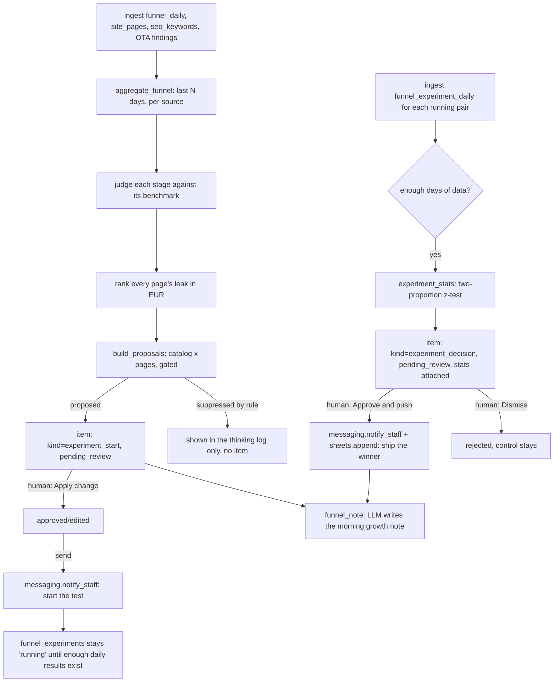

# How Funnel Hacking AI works

One deterministic funnel-analysis engine, plus a second deterministic pass
that scores experiments once real results arrive. Nothing here is invented
technology: every piece maps to a `tools/*.py` module you can read end to
end. **The engine that ranks the leak and proposes a fix is pure functions
over plain data — no network call, no model call, no randomness.** The only
place a model is ever used is to write a short prose summary of a run that
has already finished; it never sees a number before that number is final,
and it never writes a headline, a button label or a subject line — see
"Design decisions" #2.

**What this agent does NOT do.** There is no ad platform, analytics API or
booking-engine integration anywhere in this repo — that is true of this
whole agent family, not a shortcut taken here. Your web analytics, your
booking engine and your A/B testing tool all arrive as CSV exports (or the
bundled fixtures for `make demo`). The agent's output is analysis and a
drafted experiment for a person to implement in their own CMS or testing
tool — never a live change to your website. See `docs/integrations.md`.

## The main loop (`tools/run.py`, `tools/funnel_engine.py`)

**Step 1 — ingest.** `tools/ingest.py` reads the daily funnel export, the
site-page catalog, SEO rank data and the cross-agent OTA content/listing
read from `data/imports/*.csv` (your own export, or a script you point at
your analytics/testing tool) or, for `make demo` and the tests, from
`fixtures/inbound/*.csv`. No adapter in `core/adapters/` covers a web
analytics platform, a booking engine or an A/B testing tool — see "Design
decisions" #1.

**Step 2 — aggregate.** `aggregate_funnel()` takes the last `window_days`
(30 by default) of `funnel_daily` rows, sums reach/sessions/clicks/
searches/bookings/revenue per source and in total, and computes the
conversion rate between every stage. Pure arithmetic, one function, no
branching on hotel identity.

**Step 3 — judge each stage.** Every rate is compared against its own
configured benchmark band (`config/agent.yaml: benchmarks:`) and given a
real verdict — "well under", "healthy", or "at the top of the band" — computed
from the actual numbers, not a fixed string. See "Design decisions" #4.

**Step 4 — rank the leak, on every page.** `bottleneck_projection()` runs
against **every** page in `site_pages`, not just the homepage, using a
lower benchmark for `kind: blog` pages than for ordinary pages (see
"Design decisions" #5 and #6). The page with the largest recoverable
monthly revenue, at or above the benchmark floor, is the headline
bottleneck; every other underperforming page still gets its own proposal
below.

**Step 5 — build proposals.** `build_proposals()` walks
`config/agent.yaml: experiment_catalog:` — a human-curated list of test
ideas, one page and one variable each — and, for every entry whose page is
currently below its benchmark and is not already the subject of a running
or undecided test, produces a `Proposal`. "Undecided" is checked by
`tools/run.py: _active_pairs()` against every `experiment_start` ever
queued for that `(page_slug, element)` pair, not just today's: a pair
whose most recent `experiment_start` is `pending_review`, `needs_human`,
`approved` or `edited` is skipped, same as one that is actually `sent` /
`auto_sent` and running. A `rejected` ("Dismiss") pair also stays quiet —
a human already said no to exactly this leak — until the page's projected
monthly EUR value has moved by at least `rejected_reopen_pct` (default
20%) since the rejection; only then is it treated as a materially
different leak and offered again. This is what stops the review queue
from filling up with same-day duplicates for a leak that takes more than
one day to decide on, and from re-asking about something you just
dismissed. Three gates apply once a pair clears that check, each shown in
the thinking log:

- **SEO watch** (`rules.seo_watch`, default on). Off: any catalog entry on a
  `kind: blog` page is suppressed, with the reason printed, never queued.
- **Brand voice lock** (`rules.brand_voice_lock`, default on). On: any entry
  whose `kind` is `copy` carries `brand_voice_note` from config in its
  draft — an annotation, not a check; see "Design decisions" #9 and
  `docs/safety.md`.
- **Concurrency cap** (`rules.max_2_concurrent`, default on,
  `max_concurrent_experiments: 2`). At the cap, a new proposal still shows
  so you can see what is queued, but `tools/review.py approve` refuses to
  start it until a running test is decided — see "Design decisions" #7.

**Step 6 — queue and narrate.** Every proposal becomes one `items` row
(`kind: experiment_start`), always `pending_review` — starting a test is
always a human decision, whatever the rules say; see `docs/safety.md`
"Nothing ships itself." `core.llm.complete()` is called once per pass, after
the whole analysis is final, with pre-formatted euro strings only (never a
raw number — see "Money in prompts" below) to write the growth note.

## The experiment loop (Track B)

**Step 7 — start.** A human runs `tools/review.py approve <id>` then
`tools/review.py send`. The write is `messaging.notify_staff()` (guarded
action `send_message`): a plain-text instruction naming the page, the
element, both variants and a 50/50 split — there is nothing else to
"ship," because this repo does not touch your website. The experiment now
counts as **running** for the concurrency cap and is never re-proposed
while it is.

**Step 8 — score.** Every pass, for every running pair, `tools/ingest.py`
reads `funnel_experiment_daily` (your testing tool's own daily export) for
that `(page_slug, element)`. Once it has at least `min_days_running` (14)
distinct days of data, `experiment_stats()` runs a real two-proportion
z-test on click-through (Abramowitz-Stegun normal CDF approximation) and a
booking-rate lift, and one `kind: experiment_decision` item is queued with
the full stats attached.

**Step 9 — gate and push.** `can_publish()` requires **both** statistical
significance (`rules.significance_95`, bar `significance_bar_pct`, default
95%) **and** a positive click-through lift — see "Design decisions" #3. A
lift past `big_swing_pct` (default 25%) always waits for a human, whatever
`rules.auto_rollout` says — see "Design decisions" #8. Approving and
sending a decision writes `messaging.notify_staff()` **and**
`sheets.append("experiment_decisions", …)` — the record a marketing team
actually needs to go implement the winner and remember why. Rejecting is
"Dismiss": the control stays, logged.

## Publishing: which system, which write

| Item kind | Published via | Guarded action |
|---|---|---|
| `experiment_start` | `messaging.notify_staff()` | `send_message` |
| `experiment_decision` (approved) | `messaging.notify_staff()` + `sheets.append()` | `send_message` + `sheets_write` |
| `experiment_decision` (auto-rollout eligible) | same, attempted without waiting for a human | same |

`sheets_write` is added to `review.require_approval_for` in
`config/hotel.example.yaml` for this repo specifically — see
`docs/safety.md`.

## What runs when

| Workflow | Cadence | Provider used |
|---|---|---|
| `workflows/10-funnel-analysis.md` (`tools/run.py`) | daily, or `make watch` | whatever `llm.provider` is set to (only for the note) |
| `workflows/15-experiments.md` (same pass, Track B) | every pass — scores whatever has enough data | none |
| `workflows/80-review.md` (`tools/review.py`) | whenever a human is available | none — queue operations only |
| `workflows/90-go-live.md` | once, then as needed | none |

No coach layer applies to this agent (see the brief) — there is no
free-text guest reply loop to learn from. A human's edit to a proposed
variant's wording is just a new value, not a lesson.

## Design decisions taken where the spec was open

The behavioural spec (`specs/funnel-hacking-ai.md`) was extracted from a demo
platform whose `/funnel` page is a scripted UI walkthrough, not a production
system, and it names its own gaps in section 11. This repo is a real,
runnable template, so it resolves them rather than porting the gap:

1. **No adapter covers a web analytics platform, a booking engine or an A/B
   testing tool.** These are not things any common PMS, email, messaging or
   sheets API exposes, the same way `docs/integrations.md` explains for
   every agent in this family that reads a signal no adapter has a name for.
   `tools/ingest.py` reads them from CSV, falling back to
   `fixtures/inbound/*.csv` for `make demo` and the tests.
2. **The engine never writes copy, on purpose (spec §11.2).** Both variants
   of every catalog entry are written by a person into
   `config/agent.yaml: experiment_catalog:`. The model is used once, after
   the fact, to narrate a finished analysis — never to invent a headline or
   a button label. If you want the model to *draft* variant ideas for a
   human to curate into the catalog, that is a deliberate, separately
   guardrailed extra step this repo does not take by default.
3. **The rollout gate checks direction, not just significance (spec
   §11.3).** `can_publish()` requires `click_lift > 0` as well as
   `confidence >= significance_bar_pct`. A variant that is significantly
   *worse* can never clear the gate, in any rule configuration.
4. **The three stage verdicts are computed, not fixed strings (spec
   §11.5, second half).** `judge_stages()` compares the real numbers to the
   real bands every time; there is no hardcoded "well under" that would
   still print if the numbers reversed.
5. **Every page is priced, not only the homepage (spec §11.5, first
   half).** `bottleneck_projection()` runs across every row in `site_pages`,
   and the headline bottleneck is whichever page has the largest
   recoverable monthly revenue at or above its benchmark floor — an actual
   ranking, matching the roster promise "prices every leak," not one hard-
   coded page.
6. **Blog pages get their own, lower benchmark (spec §11.6).**
   `content_click_low_pct` (default 1.0%) is separate from
   `click_low_pct` (default 4.0%, applied to `kind: page`). Scoring a
   0.4% blog article against a homepage-sized benchmark inflated the
   demo's projected numbers; a content page's own band is what
   `docs/integrations.md`'s catalog guidance asks you to set.
7. **The concurrency cap is enforced, not just displayed (spec §11.5
   context).** `tools/review.py approve` on an `experiment_start` item
   counts active pairs and refuses the approval outright at the cap,
   rather than only showing a note a human could ignore.
8. **A configurable "big swing" always waits for a human (spec §11.8).**
   The roster promise says the agent "flags big swings for review"; the
   demo had no threshold behind that sentence. `big_swing_pct` (default 25%)
   in `config/agent.yaml` is the one this repo actually enforces — a click
   lift past it is never auto-published, whatever `rules.auto_rollout` says.
9. **Brand voice lock stays an annotation (spec §11.9), by design, not by
   gap.** There is no vocabulary model in this family, and pretending one
   exists would be worse than saying plainly what the rule does: attach a
   note to any copy proposal, so a human checks tone before they ship it.
   `brand_voice_note` in `config/agent.yaml` is yours to write for your own
   property's voice guide.
10. **There is no simulated "fast-forward."** The demo UI this repo was
    built from could skip 14 days on a button click. A real agent cannot
    skip time, so `tools/run.py` simply scores whatever
    `funnel_experiment_daily` data has actually accumulated once
    `min_days_running` distinct days are present — the same CSV-arrives-
    when-it-arrives pattern as every other signal in this repo. `make demo`
    seeds one experiment as already 14 days in, precisely so you can see a
    real, finished decision without waiting two weeks — see
    `tools/demo.py`.
11. **`ota_content_findings` / `ota_listings` stay a read-only, cross-agent
    signal (spec §11.10).** They feed the "OTA referral" row's channel-health
    note only. This repo never writes those files; that boundary belongs to
    a listing-content agent, not this one.
12. **SEO stays inert on purpose (spec §11.11).** `seo_keywords` is ingested
    and shown in the digest — position, movement, volume — but never
    produces a proposal. Wiring a real "ranking dropped, propose a page-
    title fix" rule is a reasonable next step for a hotel that wants it,
    not something this repo invents evidence for.

## Restaurant lens

`venues: [hotel, restaurant]`. Nothing in the code path changes for a
restaurant; only the numbers and the catalog do:

- The stages become reach (ads, Maps/local search, social) → sessions →
  **reservation-widget clicks** (OpenTable/SevenRooms/Resy/TheFork or a
  direct widget) → date-and-party-size searches → confirmed covers.
  `funnel_daily.revenue` becomes covers × average spend, and
  `economics.avg_booking_value` in `config/agent.yaml` becomes average
  spend per booked table.
- **The hotel benchmark bands do not transfer.** `benchmarks.click_low_pct`
  (4%) and `benchmarks.search_book_low_pct` (25%) are hotel numbers with no
  evidence behind them for a restaurant funnel — re-source both from your
  own history before you trust a projection.
- `experiment_catalog` becomes the restaurant's own pages (home, menus,
  private dining, the journal) and its own ideas (a clearer "Book a table"
  button, a photo swap, a sticky reservation bar).
- `source` gains local/maps and delivery-marketplace referrals in the same
  `funnel_daily.source` column.
- `seo_keywords` becomes local-intent terms — still analytics-only, same
  rule.

See `README.md` "Who it's for" for the same note in the hotel-facing voice.

## Money in prompts

Every euro amount handed to the model is a pre-formatted string
(`"EUR 33,700"`, never `33700`) — the documented lesson from this family's
CRM agent: a model asked to reproduce a raw number sometimes drops the
currency sign. `tools/funnel_engine.py:money()` formats every amount before
it reaches a prompt, a fixture, or a review-queue line. Amounts always use
`hotel.currency`, never a hardcoded EUR — see `docs/safety.md`.
